# Запуск бота

Пререквизиты: Python 3.11, Docker Compose и uv, ключ API YandexGPT и токен Телеграм-бота

Установка зависимостей локально

```
uv sync
```

Для запуска проекта необходимо заполнить файл `.env.dist` и переименовать его в `.env`

После этого запускаем сборку

```
docker-compose up --build
```

Основные зависимости

```
dependencies = [
    "aiogram~=3.17.0",
    "aiohttp~=3.11.11",
    "python-dotenv~=1.0.1",
    "pydantic>=2.10.4",
    "redis~=5.2.1",
    "alembic~=1.14.0",
    "asyncpg~=0.30.0",
    "sqlalchemy~=2.0.36",
    "yandex_cloud_ml_sdk==0.2.4"
]
```

## Logging

Логи бота пишутся в logs.log в корневом каталоге

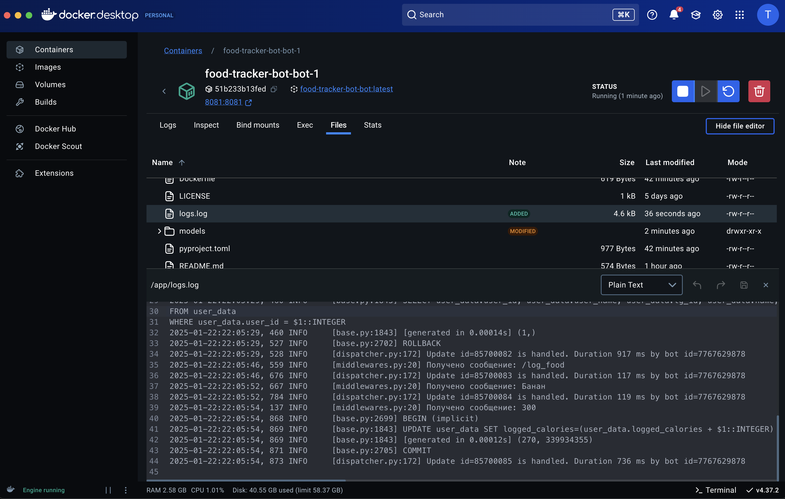

## /set_profile

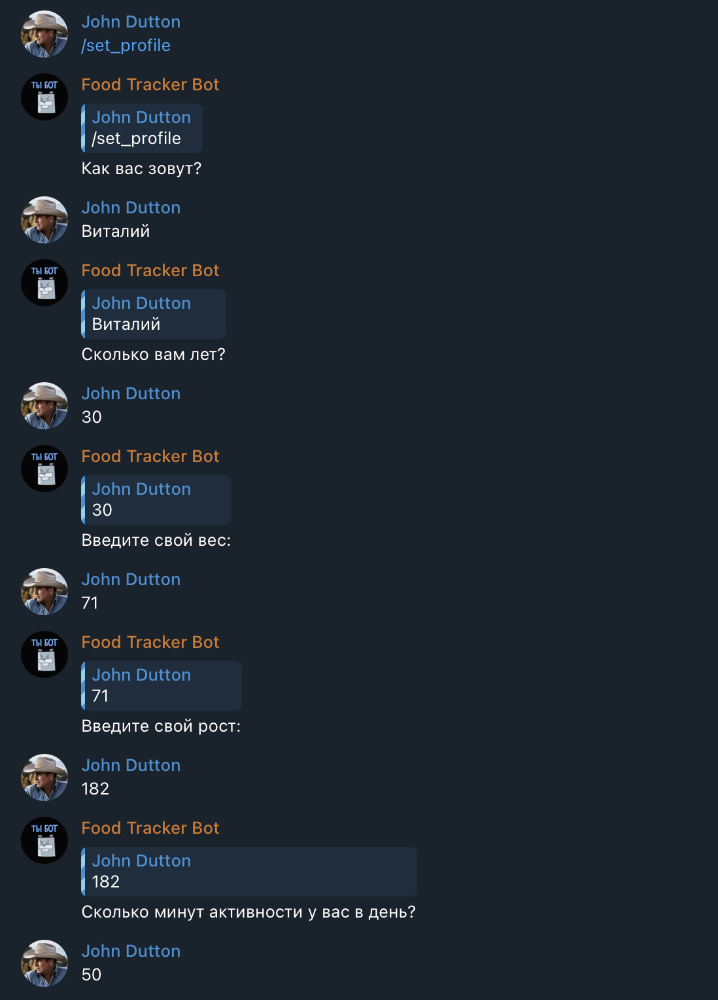


## /help

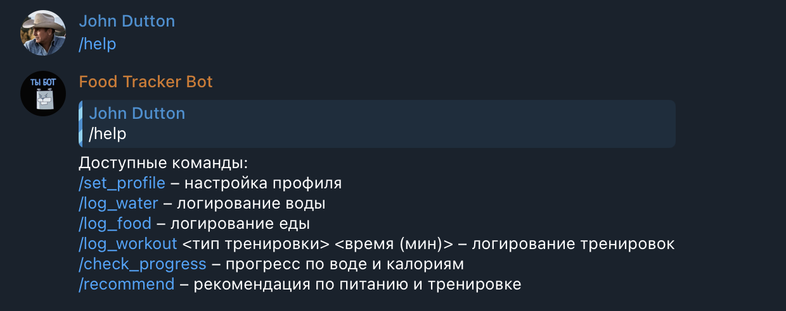

## /log_water

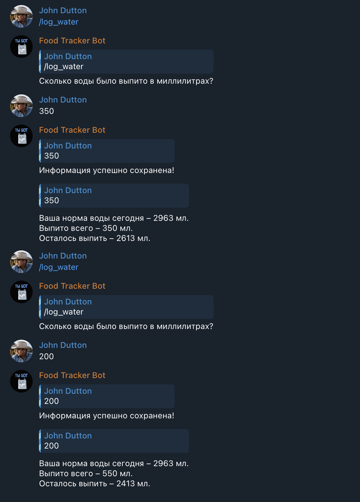

## /log_food

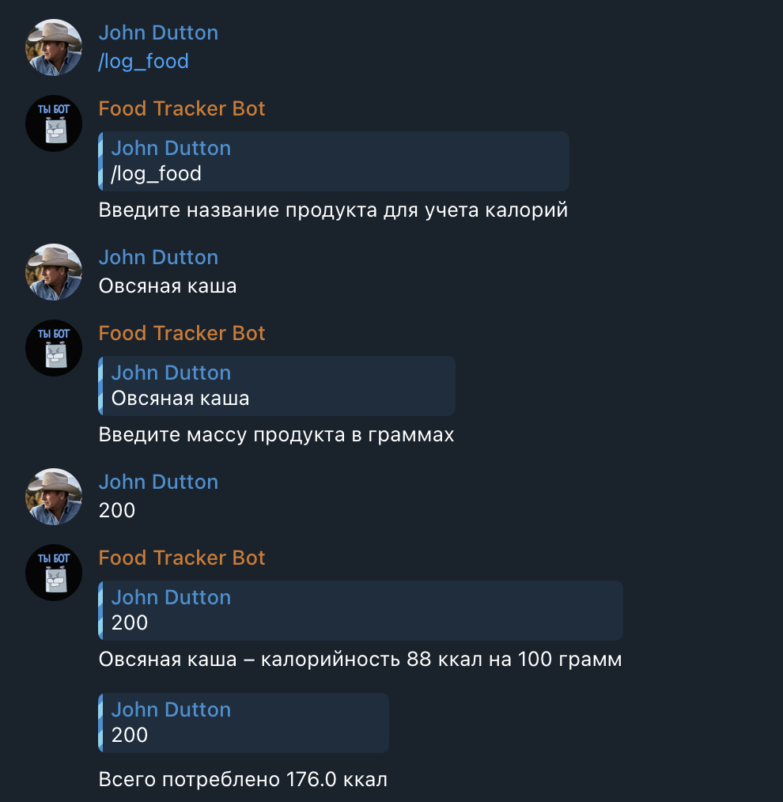

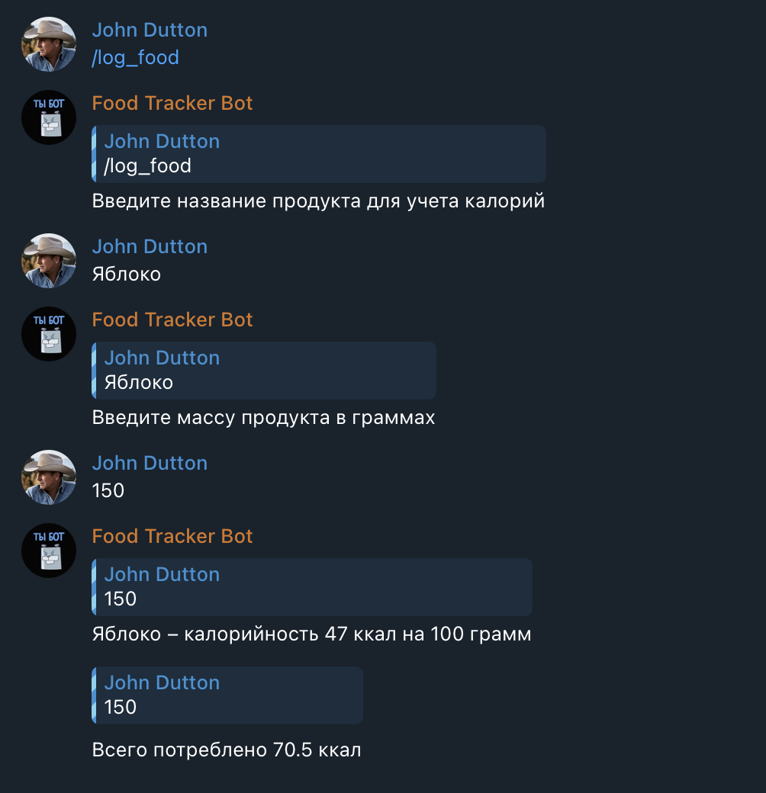

## /log_workout

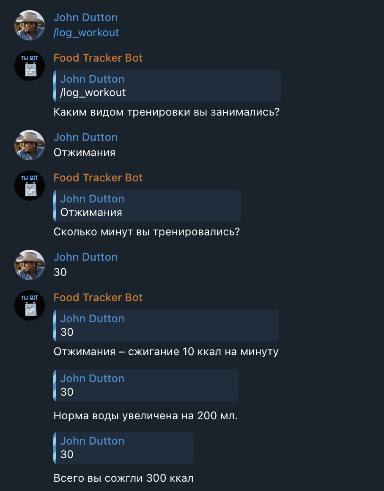

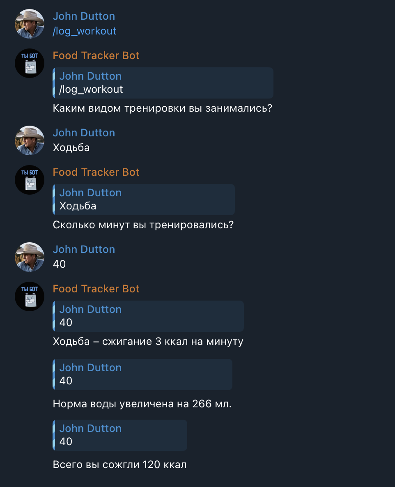

## /check_progress

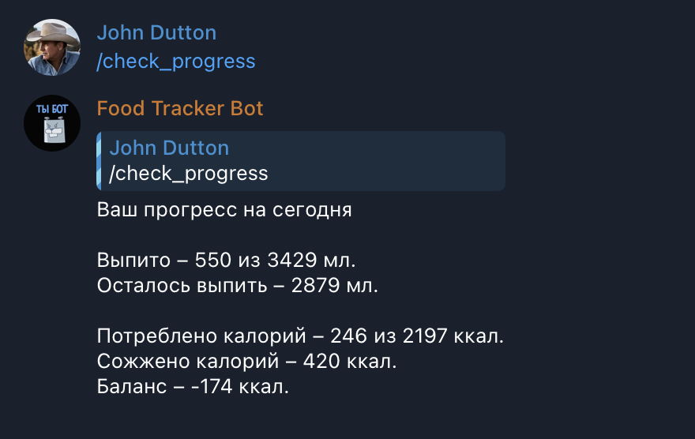

## /recommend

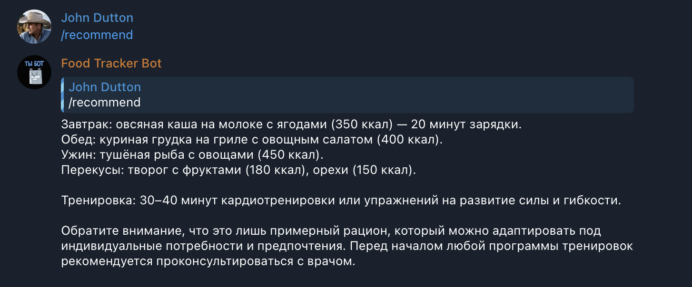

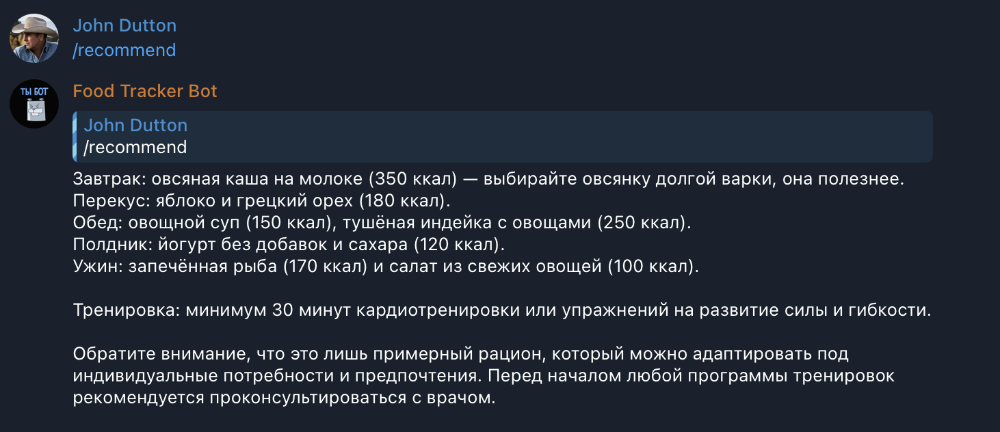

## Postgres

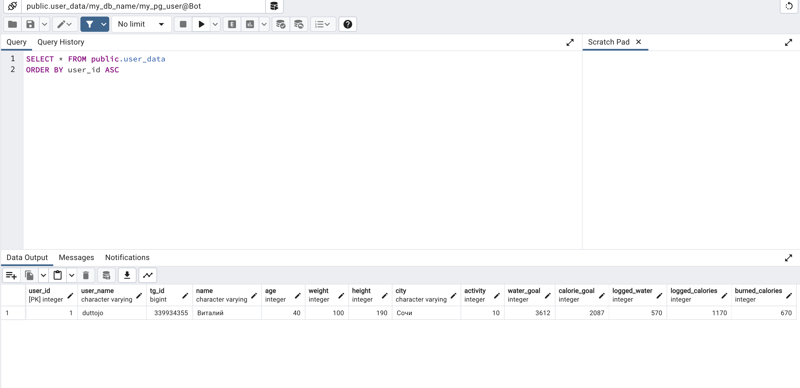
